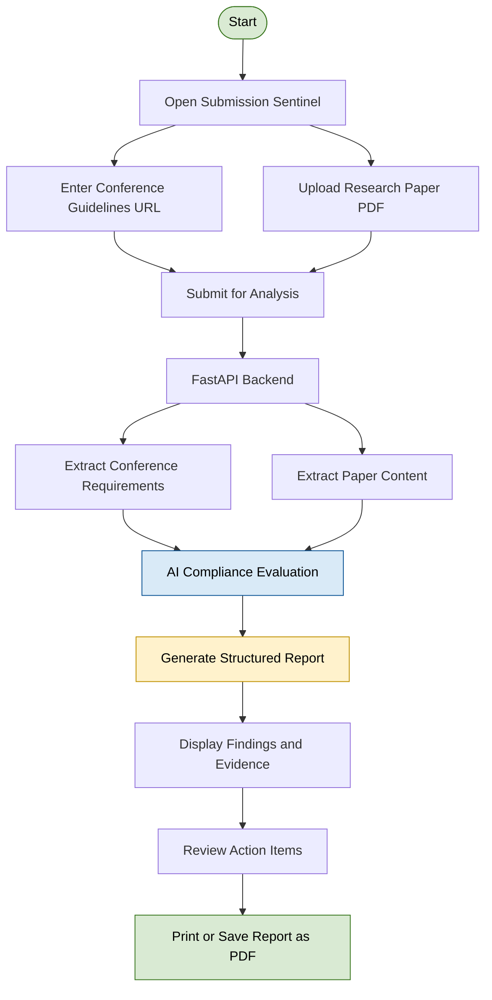
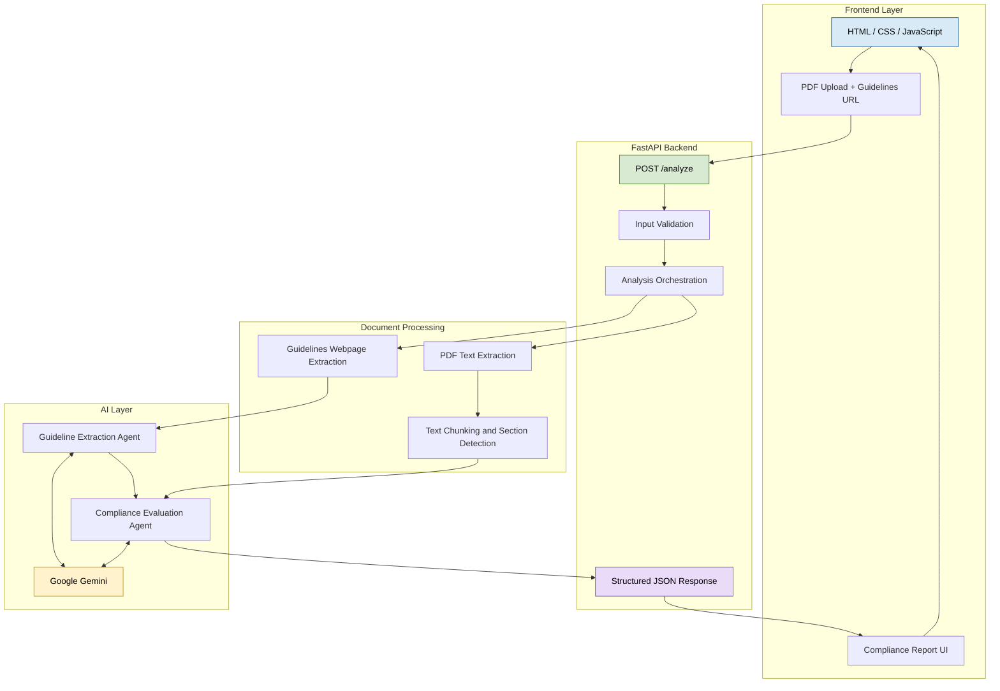
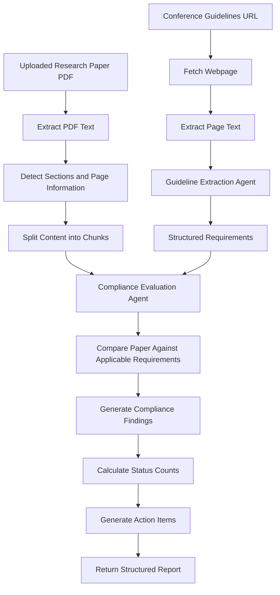

# 🛡️ Submission Sentinel

### AI-Powered Research Paper Submission Compliance Assistant

**Submission Sentinel** is an AI-powered application that helps researchers review their research papers against conference submission guidelines. It extracts requirements from a conference webpage, analyzes an uploaded PDF, and generates a structured compliance report with findings, evidence, and suggested action items.

The goal is to help authors identify potential formatting and submission issues before submitting their manuscripts.

<!-- Replace this placeholder with a screenshot of your application -->

<p align="center">
  
</p>
<p align="center">
  
</p>

<p align="center">
  
  
  
  
  
</p>

---

## Table of Contents

* [Overview](#-overview)
* [Key Features](#-key-features)
* [Visual Workflow](#-visual-workflow)
* [System Architecture](#-system-architecture)
* [AI Analysis Pipeline](#-ai-analysis-pipeline)
* [Technology Stack](#-technology-stack)
* [Project Structure](#-project-structure)
* [Getting Started](#-getting-started)
* [How to Use](#-how-to-use)
* [Example Output](#-example-output)
* [Deployment](#-deployment)
* [Current Limitations](#-current-limitations)
* [Future Improvements](#-future-improvements)
* [Disclaimer](#-disclaimer)

---

## Overview

Preparing a research paper for a conference involves more than writing good research. Authors must also follow submission guidelines covering manuscript structure, formatting, page limits, required sections, and other requirements.

Manually comparing a manuscript against a long guidelines webpage can be time-consuming.

Submission Sentinel simplifies this process by combining webpage extraction, PDF text analysis, and LLM-based evaluation into one workflow.

### The Problem

* Conference guidelines can be lengthy and difficult to review.
* Authors may overlook important formatting or structural requirements.
* Manually checking every requirement takes time.
* Identifying specific issues and deciding what to fix can be difficult.

### The Solution

Submission Sentinel takes a conference guidelines URL and a research paper PDF, extracts relevant information, evaluates the manuscript, and presents the results in a structured report.

---

## Key Features

| Feature                  | Description                                                                                     |
| ------------------------ | ----------------------------------------------------------------------------------------------- |
| PDF Analysis          | Extracts text and page information from an uploaded research paper.                             |
| Guideline Extraction  | Retrieves conference guideline webpage content for requirement extraction.                      |
| AI-Powered Evaluation | Uses Google Gemini through LangChain to evaluate the manuscript against extracted requirements. |
| Structured Findings   | Organizes findings by compliance status, evidence, and recommendations.                         |
| Compliance Summary    | Displays counts of compliant, non-compliant, partially compliant, and unverifiable findings.    |
| Action Items           | Provides a list of issues and suggested next steps.                                             |
| Web Interface        | Offers a browser-based interface for uploading a paper and submitting a guidelines URL.         |
| Report Export        | Allows the generated report to be printed or saved as a PDF through the browser's print dialog. |

---

## Visual Workflow

The following diagram illustrates the overall user workflow.



---

## System Architecture

Submission Sentinel uses a lightweight client-server architecture. The frontend collects the input, FastAPI coordinates the processing workflow, and the LangChain agents use Gemini to extract requirements and evaluate the paper.



### Component Responsibilities

| Component          | Responsibility                                                                        |
| ------------------ | ------------------------------------------------------------------------------------- |
| Frontend           | Collects the PDF and guidelines URL, sends the request, and displays results.         |
| FastAPI            | Handles HTTP requests, validates inputs, coordinates processing, and returns JSON.    |
| `tools.py`         | Contains the tools for guideline webpage retrieval and PDF content analysis.          |
| `main.py`          | Defines the LangChain agents, structured output schemas, and evaluation instructions. |
| Google Gemini      | Extracts structured conference requirements and evaluates the manuscript.             |
| `requirements.txt` | Lists Python dependencies needed to run the project.                                  |

---

## AI Analysis Pipeline

The application separates guideline extraction from manuscript evaluation.



### Stage 1: Conference Guideline Extraction

1. The application receives the conference guidelines URL.
2. The webpage content is retrieved using Python HTTP and HTML-processing libraries.
3. Relevant submission requirements are extracted using the guideline extraction agent.
4. Requirements are represented using a structured Pydantic schema.

### Stage 2: Research Paper Analysis

1. The uploaded PDF is saved temporarily.
2. PDF text is extracted using `pypdf`.
3. The processing tool identifies page information and section headings.
4. The extracted content is divided into smaller chunks using `RecursiveCharacterTextSplitter`.

### Stage 3: Compliance Evaluation

1. The extracted requirements and manuscript content are passed to the evaluation agent.
2. The agent evaluates applicable manuscript requirements.
3. Findings are organized into structured categories.
4. The application calculates the number of findings in each compliance category.
5. The report is returned to the frontend.

The evaluation is intended to focus on manuscript requirements rather than administrative requirements such as registration or attendance.

### Compliance Status Categories

| Status                | Meaning                                                                              |
| --------------------- | ------------------------------------------------------------------------------------ |
| `COMPLIANT`           | The available manuscript evidence appears to satisfy the requirement.                |
| `NON-COMPLIANT`       | The available evidence indicates that the requirement is not satisfied.              |
| `PARTIALLY COMPLIANT` | Some aspects appear satisfied, but one or more aspects need attention.               |
| `UNVERIFIABLE`        | The available content does not provide enough evidence for a reliable determination. |

---

## 🛠️ Technology Stack

| Technology               | Purpose                                           |
| ------------------------ | ------------------------------------------------- |
| Python                   | Main programming language                         |
| FastAPI                  | Backend API and request handling                  |
| LangChain                | LLM orchestration and agent integration           |
| Google Gemini            | Guideline extraction and compliance evaluation    |
| Pydantic                 | Structured output schemas and data validation     |
| `pypdf`                  | PDF text extraction                               |
| BeautifulSoup            | HTML parsing                                      |
| Requests                 | Retrieving webpage content                        |
| LangChain Text Splitters | Chunking extracted document text                  |
| HTML, CSS, JavaScript    | Frontend interface                                |
| Uvicorn                  | ASGI development and production server            |
| Git and GitHub           | Version control and source-code hosting           |
| Render                   | Intended hosting platform for the web application |

---

## 📁 Project Structure

```text
submission-sentinel/
│
├── app.py                  # FastAPI application and /analyze endpoint
├── main.py                 # LangChain agents, schemas and prompts
├── tools.py                # Webpage and PDF processing tools
├── requirements.txt         # Python dependencies
├── .gitignore              # Excluded files and sensitive configuration
├── .env                    # Local API key (not committed to Git)
│
└── frontend/
    └── index.html           # Browser-based user interface
```

The `.env` file is used for local configuration and should not be committed to the repository.

---

## Getting Started

### Prerequisites

Make sure you have:

* Python 3.10 or a compatible newer version
* Git
* A Google Gemini API key
* A research paper in PDF format
* A publicly accessible conference guidelines webpage

### 1. Clone the Repository

```bash
git clone https://github.com/ArpitJadhao/Submission-Sentinel.git
cd Submission-Sentinel
```

### 2. Create a Virtual Environment

**Windows PowerShell**

```powershell
python -m venv .venv
.\.venv\Scripts\Activate.ps1
```

**macOS / Linux**

```bash
python3 -m venv .venv
source .venv/bin/activate
```

### 3. Install Dependencies

```bash
python -m pip install -r requirements.txt
```

### 4. Configure the Gemini API Key

Create a `.env` file in the project root:

```env
GOOGLE_API_KEY=your_gemini_api_key_here
```

Use the exact environment variable name expected by your current `main.py` configuration. If the application uses a different name, update this example accordingly.

**Security note:** Never commit your real API key or share it publicly.

### 5. Start the Application

```bash
uvicorn app:app --reload
```

Open the application in your browser:

**http://127.0.0.1:8000**

The API documentation is available at:

**http://127.0.0.1:8000/docs**

---

## How to Use

1. Open Submission Sentinel in your browser.
2. Upload a research paper PDF.
3. Enter the conference's author guidelines URL.
4. Start the analysis.
5. Wait for the application to retrieve the guidelines and analyze the manuscript.
6. Review the compliance summary and individual findings.
7. Read the evidence and suggested action items.
8. Print the report or save it as a PDF using the browser's print dialog.

### Example Use Case

A researcher preparing a manuscript for a conference can provide:

* **Input 1:** The research paper PDF.
* **Input 2:** The conference's author guidelines webpage.

Submission Sentinel processes the two inputs and returns a structured report highlighting potential compliance issues that the author can review before submission.

---

## Example Output

The following is an illustrative example of the report format, not a result from a verified analysis.

```text
Submission Sentinel
Research Paper Compliance Report

Paper Title: Example Research Paper

Compliance Summary
------------------
Compliant:             8
Non-Compliant:         2
Partially Compliant:   3
Unverifiable:          1

Findings
--------
1. Requirement: Manuscript structure
   Status: COMPLIANT
   Evidence: Relevant sections were identified.
   Action: No immediate action suggested.

2. Requirement: Page limit
   Status: UNVERIFIABLE
   Evidence: The available extraction was insufficient
             to confirm the applicable page limit.
   Action: Verify the official conference requirements.

Action Items
------------
- Review findings marked non-compliant.
- Resolve partially compliant requirements.
- Manually verify unverifiable findings.
- Confirm final compliance using official guidelines.
```

Actual findings and counts depend on the uploaded paper, extracted webpage content, and AI evaluation.

---

## Deployment

The application is designed to serve its frontend and backend from the same FastAPI service.

For deployment on Render, use the following configuration:

| Setting              | Value                                                                      |
| -------------------- | -------------------------------------------------------------------------- |
| Repository           | `ArpitJadhao/Submission-Sentinel`                                          |
| Branch               | `main`                                                                     |
| Build command        | `pip install -r requirements.txt`                                          |
| Start command        | `uvicorn app:app --host 0.0.0.0 --port $PORT`                              |
| Secret configuration | Add the Gemini API key through the hosting platform's environment settings |

After deployment, open the assigned service URL and test the complete workflow.

**Deployment status:** Update this section with your public demo URL once deployment is successful.

---

## Current Limitations

Submission Sentinel is a prototype intended for demonstration and experimentation.

* AI-generated findings may be incorrect or incomplete.
* PDF text extraction may not accurately capture complex layouts, tables, figures, or visual formatting.
* Some requirements may be impossible to verify from extracted text alone.
* Webpage extraction depends on the accessibility and structure of the conference website.
* Requirements that require visual inspection may need manual verification.
* The application depends on Gemini API availability, quotas, and applicable usage charges.
* The current session and temporary-file handling are not designed as a full multi-user production system.
* The application has not been established as an authoritative conference compliance checker.

---

## Future Improvements

Potential improvements include:

* [ ] Add screenshot examples and a short demo GIF.
* [ ] Improve extraction of complex PDF layouts and tables.
* [ ] Add stronger evidence citations with page numbers.
* [ ] Support conference template files and document-format checks.
* [ ] Add automated tests for API endpoints and processing tools.
* [ ] Improve handling of unavailable or dynamically rendered guideline pages.
* [ ] Add rate limiting and safer external URL fetching.
* [ ] Add user-friendly error messages and progress indicators.
* [ ] Evaluate output quality using a repeatable test dataset.
* [ ] Add optional RAG-based retrieval and more targeted document comparisons.

---

## Security Considerations

* Keep API keys in environment variables.
* Exclude `.env`, virtual environments, and test PDFs from version control.
* Validate uploaded files and enforce upload size limits.
* Treat external guideline webpages as untrusted input.
* Before public production use, strengthen URL-fetching protections, request limits, and API usage controls.

---

## Disclaimer

Submission Sentinel is an AI-assisted review tool. It does not guarantee acceptance by a conference or complete compliance with every submission requirement. Always verify important findings against the official conference guidelines and inspect the manuscript manually before submission.

---

## Author

**Arpit Jadhao**

Computer Technology Student | AI & Machine Learning | LangChain | Python

* GitHub: [@ArpitJadhao](https://github.com/ArpitJadhao)

---

<p align="center">
  <b>Built to make research paper preparation easier, more structured, and more transparent.</b>
</p>
